# Docker Compose Provider Services - Azure PostgreSQL Example

This example demonstrates how to use Docker Compose provider services with Azure PostgreSQL.

## What is a Provider Service?

Provider services in Docker Compose represent platform capabilities (like managed databases) rather than containers. They allow you to declare dependencies on cloud platform features that your application needs.

## Architecture

```mermaid
flowchart TB
    subgraph DC["Docker Compose"]
        Web["🌐 web<br/>(Node.js)"]
        Worker["⚙️ worker<br/>(Node.js)"]
        Provider["📦 postgres<br/>(provider service)"]

        Web -->|depends_on| Provider
        Worker -->|depends_on| Provider
    end

    Provider -->|provisions & configures| Azure["☁️ Azure Platform<br/>PostgreSQL Flexible Server"]

    Azure -.->|injects env vars:<br/>POSTGRES_HOST<br/>POSTGRES_PORT<br/>POSTGRES_DATABASE<br/>POSTGRES_USER<br/>POSTGRES_PASSWORD| Web
    Azure -.->|injects env vars| Worker

    style Provider fill:#667eea,stroke:#764ba2,stroke-width:2px,color:#fff
    style Azure fill:#0078d4,stroke:#005a9e,stroke-width:2px,color:#fff
    style Web fill:#68d391,stroke:#38a169,stroke-width:2px
    style Worker fill:#68d391,stroke:#38a169,stroke-width:2px
    style DC fill:#f7fafc,stroke:#cbd5e0,stroke-width:2px
```



## How It Works

1. **Provider Declaration**: The `postgres` service uses the `provider` attribute instead of defining a container
2. **Platform Provisioning**: When you run `docker compose up`, the Azure provider provisions a PostgreSQL instance
3. **Environment Injection**: The provider injects connection details as environment variables into dependent services
4. **Automatic Configuration**: Both `web` and `worker` services automatically receive credentials without manual configuration

## Environment Variables Injected

The Azure PostgreSQL provider automatically injects these variables into dependent services:

- `POSTGRES_HOST` - Azure PostgreSQL server hostname
- `POSTGRES_PORT` - Database port (typically 5432)
- `POSTGRES_DATABASE` - Database name
- `POSTGRES_USER` - Database username
- `POSTGRES_PASSWORD` - Database password
- `POSTGRES_URL` - Full PostgreSQL connection string

## Prerequisites

**Note**: This is a conceptual example. To actually use this, you would need:

1. Docker Compose 2.36.0 or later
2. An Azure provider plugin for Docker (hypothetical - would need to be implemented)
3. Azure credentials configured
4. The provider plugin installed: `docker plugin install azure-provider`

## Usage

### Start the application

```bash
docker compose up
```

### Test the application

```bash
# Check health
curl http://localhost:3000/health

# Get visitor count
curl http://localhost:3000/

# Record a visit
curl -X POST http://localhost:3000/visit
```

### Stop the application

```bash
docker compose down
```

## Provider Configuration Options

The `postgres` provider service supports these Azure-specific options:

- `server_name` - Name of the PostgreSQL server in Azure
- `database_name` - Name of the database to create
- `sku` - Pricing tier (e.g., B_Gen5_1 for Basic tier)
- `storage_mb` - Storage size in megabytes
- `backup_retention_days` - Number of days to retain backups
- `geo_redundant_backup` - Enable geo-redundant backups
- `ssl_enforcement` - Require SSL connections

## Benefits

1. **No Manual Setup**: No need to manually create and configure Azure PostgreSQL
2. **Declarative**: All infrastructure declared in `docker-compose.yml`
3. **Consistent Workflow**: Use standard `docker compose` commands
4. **Automatic Credentials**: Connection details automatically injected
5. **Multi-Service**: Multiple services can depend on the same provider

## Files

- `docker-compose.yml` - Compose file with provider service definition
- `app/index.js` - Web service that connects to Azure PostgreSQL
- `app/worker.js` - Background worker that processes data
- `app/package.json` - Node.js dependencies

## Real-World Implementation

Currently, provider services are a newer feature in Docker Compose. For actual Azure PostgreSQL integration, you might:

1. Wait for official Azure provider plugins
2. Create a custom provider plugin (see [Compose Extensions](https://github.com/docker/compose/blob/main/docs/extension.md))
3. Use the existing Docker Model Runner as a reference implementation

## Learn More

- [Docker Compose Provider Services Documentation](https://docs.docker.com/compose/how-tos/provider-services/)
- [Compose Extensions Documentation](https://github.com/docker/compose/blob/main/docs/extension.md)
- [Azure Database for PostgreSQL](https://azure.microsoft.com/en-us/products/postgresql/)
